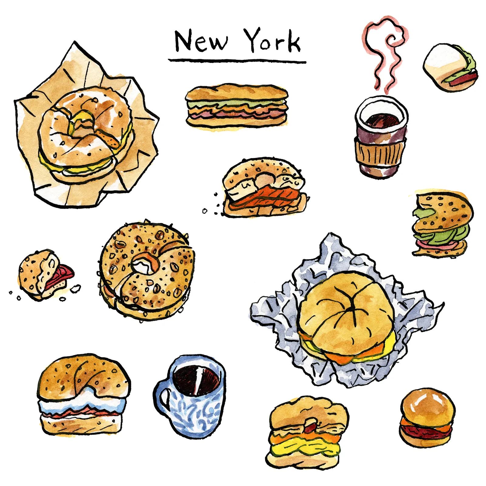

# Big-Apple-Bite-Safe

## Group: team 8 - Big Apple Bite Safe

## Team Members:
Isa Wang(yw3886)
Tracy Hu(sh4355)
Karl Liu(wl2916)
  

## Access Points to Deployments
All hosted on Google Cloud Platform's Virtual Machine (Compute Engine)
Airflow:
[http://35.202.94.98:8080/](http://34.133.119.120:8080/)

Web Application:
[http://35.202.94.98:5001/](http://34.133.119.120:5001/)

## Project Structure Overview

- **Deployment Code:** All primary application code and scripts are located within the `/Deployment` directory. This section contains the essential components required for the deployment of our application.

- **Data Preprocessing, Model Exploration, and Visualization:** For a detailed examination of our data preprocessing methodologies, model exploration, and visualization techniques, please refer to the Jupyter Notebook files located in the `/Exploration&Visualization` folder. This area is dedicated to providing a comprehensive understanding of the underlying processes and analytical methods utilized in our project.

